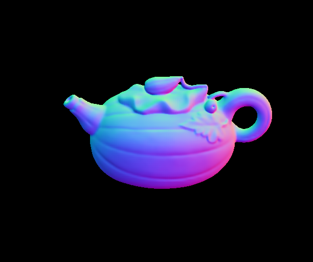
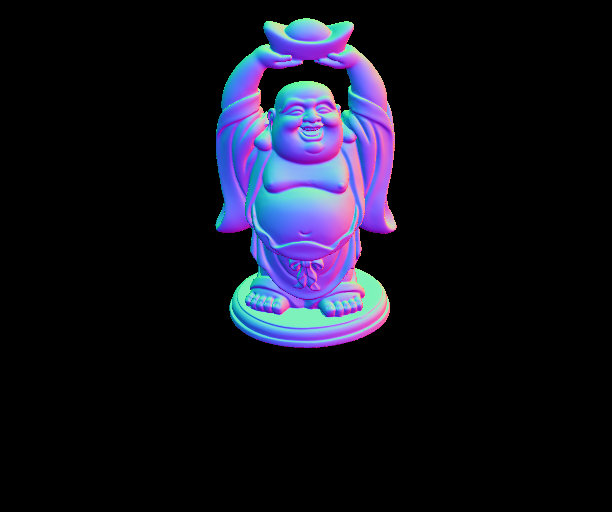
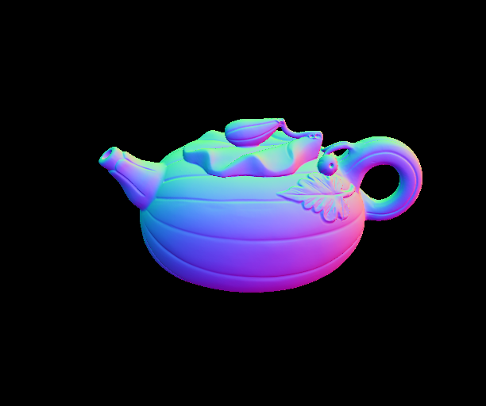

# PS- FCN Implementation 

### Directory Structure -:
-   **train.py:**  Run this file to train the model. The save path of the trained model can be edited in the file by changing the line   
```torch.save(model, './TrainedModels/model_bn_30.pth.tar')```   
sample command to train the model : ```CUDA_VISIBLE_DEVICES=0 python train.py --in_img_num 32 --use_BN --epochs 30```. Refer to the argparser.py file for other default args. The model after training is saved in the *TrainedModels* folder unless otherwise changed in the file

-  **argparser.py** Contains 2 classes corresponding to args for testing and training. The default arg setting and variables names are the standard ones, hence not elaborating in detail on them. `--use_BN` enables batchnorm, `--epochs` specifies the number of epochs and `--in_img_num` selects the number of images in the training dataset on which the model is to be trained. 

-  **model.py** Contains the PS-FCN architecture as described in the paper. This implementation uses max-pool for multi feature fusion. 

-  **utils.py** Has helper functions for defining the loss criterion, calculating the error between the predicted normal map and the ground truth etc. 

-  **eval.py** Run this file to test the model. The model to be tested can be specified using the `--model_path` flag, followed by the location of the model. If you use batch norm in the training model, be sure to also use the `--use_BN` flag while running this file also. Sample command to test the model :  ```CUDA_VISIBLE_DEVICES=0 python eval.py --use_BN --model_path './TrainedModels/model_bn_30.pth.tar' --in_img_num 96```. The image name to be saved can be changed in the file by editing the line ```save_path = './Results/' + 'img8_%d.png' % (i+1)``` 
The results are stored in the *Results* foler.

-  **scripts** contains the scripts given by the authors to download the DiLiGenT and Blobby Dataset in the data folder. 

-  **dataloader** contains the scripts given by the authors to parse the data in the required format

This implementation uses CUDA 8.0, scipy, numpy, pytorch 0.4.1, and python 2.7 


### Instructions to execute the code -:

-  Clone the repository from github -:

>``` git clone ```

-  In the data folder, run the scripts to download the DiLigent and Blobby datasets. The authors train their model on both the Blobby and Sculpture datasets, but due to lack of time and compute resources, I trained them only on the blobby Dataset. 

> ``` cd scripts/```    
  ``` sh prepare_diligent_dataset.sh ```  
  ``` sh download_synthetic_datasets.sh ```  
  ``` cd ..```

Make sure that the `--data_dir` and `--bm_dir` flags have appropriate paths for the train and test datasets respectively. Refer to the default arguments in the argParser.py file. The above code snippet ensures that the default arguments suffice and one need not specify them separately. 
Once after cloning the repo, you might want to add the Results and data folder to the .gitignore file. 
-  In the train.py file, specify the path where the model should be saved as described above, and then run the sample command described above from the PS-FCN-Chinmay folder with desired argument specifications to train the model. Use the `--masked_loss` flag to train the model with the modified loss function.

> ```CUDA_VISIBLE_DEVICES=0 python train.py --in_img_num 8 --use_BN --epochs 30```

-  After the model is trained, execute the eval.py file to test the model obtained after training on the DiLiGenT dataset. Specify the path from which the model is to be loaded in the file using the `--model_path` flag. Use the argument flags as required. The *TrainedModels* folder contains some models I trained for this experiment.

> ```CUDA_VISIBLE_DEVICES=0 python eval.py --use_BN --model_path './TrainedModels/model_bn_8.pth.tar' --in_img_num 96```

-  The mean error on all the images of the dataset in displayed on the terminal. You can see the generated surface normal maps for images in the DiLiGenT dataset in the *Results* folder.


### Changes and modifications to the PS-FCN model -: 
This section briefly highlights the changes I tried to implement to the PS-FCN model. The code given by the authors is very well written and organized but a bit too modular, which I tried to simplify in my implementation. The code structure is quite compact since I have kept only the bare minimum options as arguments, which simplifies the argument parsing in my implementation. For instance, my code allows the use of only the Adam optimizer and cosine loss. The data parsing code for the train and test dataset is same as that used by the authors due to time constraints. These are the approaches I tried in my implementation.

-  *Using masked loss* The cosine loss used in the paper averages the cosine loss between the predicted and true normal over all pixels. To deal with the pixels which contribute more to the loss in a better way, I introduced stochasticity to the loss function. For every pixel in a batch/image, a cosine loss was computed. This loss matrix was then normalized, and a bernoulli mask was generated by sampling every element of the mask with the corresponding pixel/element value of the normalized loss matrix. The loss matrix was then masked using this approach before calculating the mean loss for a batch.

-  *Using Batch Normalization* Batch normalization is a popular technique used for improving accuracy and ensuring faster convergence while training. I tried training the model using batch normalization for all layers in the Siamese network and obtained the results shown below. The paper does not mention anything about using batch normalization, and the pre-trained models given by the authors are also obtained without batch normalization hence investigated this approach

-  *Using Dilated Convolutions* Dilated convolutions support exponential expansion of the receptive field without loss of resolution or coverage. Since the paper mentions that the algorithm does not perform well on dark images, I felt that increasing the receptive field in the first layer might be helpful hence tried this approach. The next section analyzes the effect of these modifications.


### Results 

On training the PS-FCN architecture with batch normalization and dilated convolution for 30 epochs and 8 image light pairs per sample on the blobby dataset, I obtained a mean of error of 12.023 on testing it with the DiLiGent Dataset with 96 image light pairs per object. The image results for the 9 objects can be found in the `ResultsNotebook` folder. Here I display the normal maps inferred by PS-FCN for 3 of the objects inferred using a model with dilated convolutions and without batch normalization -:

 




The true normal maps corresponding to these objects are -:




The differences in the ground truth and estimates can be seen clearly. We see that PS-FCN is not able to detect the finer sharp features in the objects very accurately. 

The mean error reported in the paper over all objects in the DiLiGenT dataset is 8.39. It is important to note here that the mean error reported in the paper is using a model trained on both sculpture dataset and the Blobby dataset, while I have trained the model only on one dataset.

You can refer to images for other objects and models trained using the different approaches mentioned above in the *ResultsNotebook* folder. The following table lists down the test errors (on the DiLiGenT dataset) of models trained using a dilated convolution layer, with and without batch norm on blobby dataset with 8 image light pairs per object.

| Object no.  |  With BatchNorm | Without BatchNorm  |
|-------------|-----------------|--------------------|
|     1       |    3.417        |       2.894        |
|     2       |    6.582        |       7.137        |
|     3       |    16.586       |       11.105       |
|     4       |    8.317        |       6.359        |
|     5       |    10.520       |       8.355        |
|     6       |    13.590       |       10.051       |
|     7       |    22.148       |       18.101       |
|     8       |    9.788        |       8.418        |
|     9       |    10.723       |       8.315        |
|     10      |    18.561       |       15.266       |
| Mean Error  |    12.023       |       9.6          |


The above table suggests that one does not get any improvements using batch normalization on this dataset, and that the performance slightly worsens on using batch normalization. Comparing the results visual results in the ResultsNotebook folder shows no stark difference as well. On Training the model without batch normalization and without a dilated convolution layer, the mean error was observed to be 9.805. Hence one can infer that using these 2 techniques does not give any significant improvement.

On observing that batch normalization does not fetch much improvement, I trained the model using the masked loss approach without batch normalization on a similar setup as in the above experiment. Using the masked loss suffers significantly in performance on the test dataset, giving a mean loss of 15 as compared to the other approaches.


### Other ideas to test and aspects to work on-:
Mentioning some of the other aspects that can be further pondered over in future -:

-  Using a prior or a different architecture to improve performance for uncalibrated PS-FCN. The given paper just removes the extra concatenated $3 \times h \times w$ image from the input to handle uncalibrated measurements, but there is no intuition as to why the model works well even for uncalibrated measurements.

-  Incorporating the lighting direction more effectively in the model. In the paper the authors create an image out of the lighting vector for a particular image, and concatenate it with the input. Investigating the effect of augmenting the lighting vector at a later conv layer would be interesting. 

-  Improving detection of finer object features. Since we observed that PS-FCN suffers in performance at locations or for objects with finer surface features, this seems a direction one can pursue to improve the network architecture.

### Conclusion -:
We observed that the masked loss function despite being an interesting approach gives no improvements. It needs to be tested with more data for a better comparison. Using dilated convolutions is a marginally better approach. Using dilated convolutions for more layers in the network may lead to a more significant improvement, and needs to be tested thoroughly.
